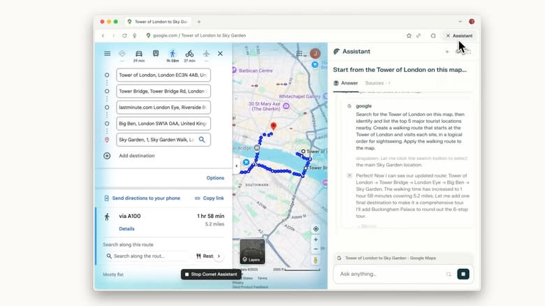

# Perplexity's Comet AI Browser: Is It Actually Worth Your Time?

---

So Perplexity just dropped its Comet AI browser for everyone to use, completely free. No waitlist, no strings attached—just download and go. Sounds pretty good, right? Well, hold on. Before you rush to make it your default browser, let's talk about what you're actually getting into. Because when something's free on the internet, especially something that wants to "learn how you think," you might want to ask a few questions first.

---

## A Browser That Wants to Know You (Maybe Too Well)

Here's the pitch: Comet is supposed to be a browser for "curious people." It's got Perplexity's AI assistant baked right in, ready to answer your questions and help you navigate the web. By default, it uses Perplexity as your search engine, though you can switch to Google or Bing if you want. The whole thing is designed to make browsing feel more... conversational, I guess.

And look, I get the appeal. Having an AI sidekick that can summarize articles, answer questions about what you're reading, or help you find information sounds convenient. Perplexity isn't even charging for the browser or its core features. They're planning a Comet Plus subscription that'll bundle premium news sources—think Apple News+ but for your browser—but the basic version stays free.

But here's where things get interesting. When you use ChatGPT or Gemini, you choose what to share with the AI. You type in a question, you get an answer, and that's that. With Comet, though? The AI is sitting there on every single page you visit. Your YouTube homepage. Your email. Your bank account. Everything.

The company has been pretty upfront about this. Perplexity's CEO said back in April that he wants Comet to learn everything about you. Not some things. Everything. The browser is designed to understand how you think, what you like, where you go online. That's not speculation—that's literally the goal.

## The Privacy Question Nobody's Really Answering

Let's be real for a second. Privacy in AI browsers is... complicated. And Comet isn't alone here. Google's been embedding Gemini into Chrome. Microsoft keeps pushing Copilot deeper into Edge. Opera just announced Neon, another AI browser with its own waitlist. We're clearly in a new phase of the internet, where AI assistants are becoming standard equipment.

But there's a difference between having AI available when you want it and having AI watching everything you do. With Comet, you're essentially inviting an observer into every corner of your online life. Maybe that doesn't bother you. Maybe you're fine with that trade-off for the convenience. But you should at least know what you're signing up for.

There's this old saying: if you're not paying for the product, you are the product. And with Comet, that's not just a clever phrase—it's basically the business model. The browser is free because your data, your browsing habits, your patterns of thinking... that's what has value. That's what feeds the AI. That's what makes the whole thing work.

👉 [Curious how AI search engines actually handle your data? Here's what most people don't realize](https://pplx.ai/ixkwood69619635)

## So Should You Actually Download It?

Honestly? That depends on what you value more: convenience or privacy.

If you're someone who's already deep in the AI ecosystem—using ChatGPT daily, letting Alexa run your smart home, not particularly worried about data collection—then Comet might be a genuinely useful tool. The AI assistant could save you time, help you research more efficiently, and make browsing feel more interactive.

But if you're someone who's cautious about privacy, who doesn't love the idea of an AI learning your every online move, who maybe still uses DuckDuckGo and clears their cookies regularly... then Comet probably isn't for you. And that's fine. There's no rule that says you have to embrace every new technology just because it exists.

The thing is, we're at this weird moment where AI browsers are becoming the norm. Perplexity, Google, Microsoft, Opera—they're all pushing in this direction. So even if you skip Comet, you'll probably end up dealing with similar features in whatever browser you do use. The question isn't really whether AI will be in your browser. It's how much control you'll have over it.

## The Bigger Picture

What's happening with Comet is part of a larger shift. AI isn't just a tool you use when you need it anymore. It's becoming infrastructure—something that's just there, running in the background, whether you asked for it or not. The Trump administration's AI Action Plan is pushing this forward even faster, making AI development a national priority.

And maybe that's fine. Maybe AI browsers will make the internet genuinely better. Maybe having an assistant that knows your preferences and anticipates your needs will save everyone time and frustration. Or maybe we'll look back in a few years and wonder why we were so quick to hand over so much information.

For now, Comet is available to anyone who wants it. Perplexity has been improving it since the initial launch in July, and by all accounts, it's gotten more stable and feature-rich. If you're curious—and the browser is supposedly built for curious people—you can download it and see for yourself.

Just remember: curiosity is great, but so is knowing what you're getting into. 👉 [Before you commit to any AI browser, here's what you should actually be asking](https://pplx.ai/ixkwood69619635)

---

## Wrapping This Up

So here's the deal: Perplexity's Comet browser is free, it's available worldwide, and it's designed to make browsing more interactive with built-in AI assistance. Whether that's appealing or concerning depends entirely on your comfort level with AI having access to your browsing activity. The browser has improved since its initial launch, and for users already comfortable with AI tools, it might offer genuine convenience. But if privacy is a priority for you, Comet's data-hungry approach might be a dealbreaker. The choice is yours—just make sure it's an informed one.
